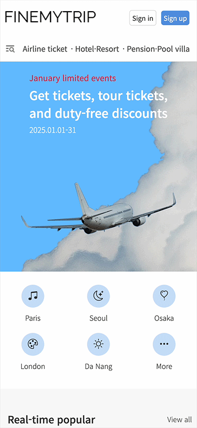
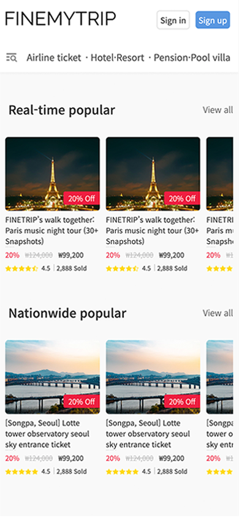
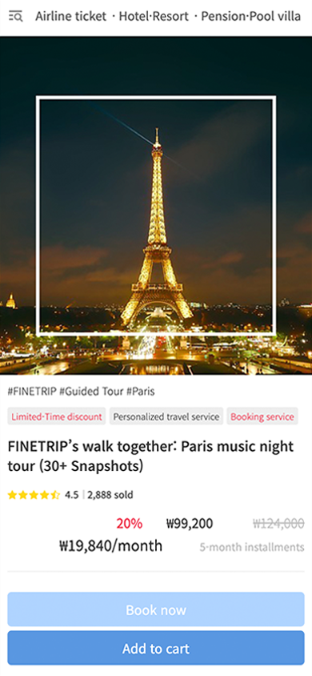

# FineMyTrip Frontend

A modern travel booking platform built with Next.js, offering seamless travel experiences with real-time product listings, user authentication, and responsive design.

## 🚀 Features

### User Interface
- **Trend-Driven Design**: Modern layouts reflecting the latest UI trends
- **Intuitive Navigation**: User-friendly menu structure and logical browsing flows
- **Mobile-First Responsiveness**: Fully optimized for mobile devices with seamless desktop support
<p align="left">
  &nbsp;&nbsp;&nbsp;&nbsp;
  
</p>

### User Experience
- **Smooth Pagination**: Fluid, continuous pagination animations for natural content transitions
- **Interactive Carousel**: Responsive to touch and mouse hover, showcasing diverse promotional content slides
- **Dynamic Filters**: Real-time search and filtering by price range, region, theme, and more
- **Lazy Loading**: Preloading images and components to improve initial load performance
- **Pull-to-Refresh**: Native-style refresh UX for mobile environments
<p align="left">
  &nbsp;&nbsp;&nbsp;&nbsp;
  
  
</p>

### Core Features
- **Comprehensive Product Listings**: Detailed pages for domestic and international travel products
- **Real-Time Content**: Backend API integration for automatic updates of promotions and events
- **Secure Authentication**: Robust login and registration system powered by JWT
- **Image Optimization**: Fast image delivery via WebP conversion and CDN integration
- **Localization & i18n**: Multilingual support for a global user experience
- **Offline Support**: Service Worker–based caching to serve content even when offline

### Performance & SEO
- **Code Splitting**: Dynamic imports to minimize bundle sizes
- **SEO-Friendly Routing**: SSR and SSG support for enhanced search engine visibility
- **Caching Strategies**: HTTP caching policies and SWR library usage for data freshness
- **Accessibility (a11y)**: ARIA attributes and keyboard navigation support for compliance

## 📁 Project Structure

```
finemytrip-frontend/
├── app/                          # Next.js 13+ App Router
│   ├── favicon.ico
│   ├── fonts.css
│   ├── globals.css
│   ├── layout.tsx                # Root layout with providers
│   ├── page.tsx                  # Home page with product listings
│   ├── product-detail/
│   │   └── [id]/
│   │       └── page.tsx          # Dynamic product detail pages
│   └── signup/
│       └── page.tsx              # User registration page
├── components/                   # Reusable UI components
│   ├── CategoryShortcut.tsx      # Category navigation
│   ├── Footer.tsx                # Site footer
│   ├── Header.tsx                # Navigation header with auth
│   ├── MainSlide.tsx             # Main slider component
│   ├── MegaNav.tsx               # Mega navigation menu
│   ├── ProductSlide.tsx          # Product carousel
│   └── SigninModal.tsx           # Login modal
├── lib/                          # Utility libraries
│   ├── api.ts                    # API client and endpoints
│   └── auth-store.ts             # Zustand authentication store
├── public/                       # Static assets
│   ├── images/
│   └── *.svg
├── eslint.config.mjs
├── next.config.ts
├── package.json
├── postcss.config.mjs
├── tsconfig.json
└── yarn.lock
```

## 🛠 Tech Stack

### Frontend Framework
- **Next.js 14**: React framework with App Router for server-side rendering
- **TypeScript**: Type-safe JavaScript development
- **Tailwind CSS**: Utility-first CSS framework for styling

### State Management
- **Zustand**: Lightweight state management with persistence
- **React Hooks**: Local component state management

### HTTP Client & API
- **Axios**: Promise-based HTTP client with interceptors
- **RESTful APIs**: Backend integration with custom API client
- **JWT Authentication**: Secure token-based authentication with auto-refresh

### UI/UX Libraries
- **Swiper.js**: Touch-enabled slider/carousel for interactive content
- **Bootstrap Icons**: Icon library for consistent UI elements
- **CSS Modules**: Scoped styling for components

### Development Tools
- **ESLint**: Code linting and quality assurance
- **PostCSS**: CSS processing and optimization
- **Yarn**: Package manager for dependency management

## 🚀 Getting Started

### Prerequisites
- Node.js 18+ 
- Yarn package manager

### Installation
```bash
# Clone the repository
git clone https://github.com/your-username/finemytrip-frontend.git

# Navigate to project directory
cd finemytrip-frontend

# Install dependencies
yarn install

# Set up environment variables
cp .env.example .env.local
# Edit .env.local with your configuration

# Run development server
yarn dev
```

### Environment Variables
```env
NEXT_PUBLIC_API_BASE_URL=<api-base-url>
```

### Available Scripts
```bash
yarn dev          # Start development server
yarn build        # Build for production
yarn start        # Start production server
yarn lint         # Run ESLint
yarn type-check   # Run TypeScript type checking
```

## 🔧 API Integration

The application integrates with a RESTful backend API providing:
- Product management endpoints
- User authentication services
- Content management system
- Real-time data updates

## 🎨 Design System

- **Color Palette**: Blue (#5997e1) primary, with gray scale
- **Typography**: Noto Sans font family
- **Components**: Reusable UI components with consistent styling
- **Responsive**: Mobile-first design approach

## 🤝 Contributing

1. Fork the repository
2. Create your feature branch (`git checkout -b feature/AmazingFeature`)
3. Commit your changes (`git commit -m 'Add some AmazingFeature'`)
4. Push to the branch (`git push origin feature/AmazingFeature`)
5. Open a Pull Request

## 📞 Support

For support and questions, please contact the development team or create an issue in the repository.
